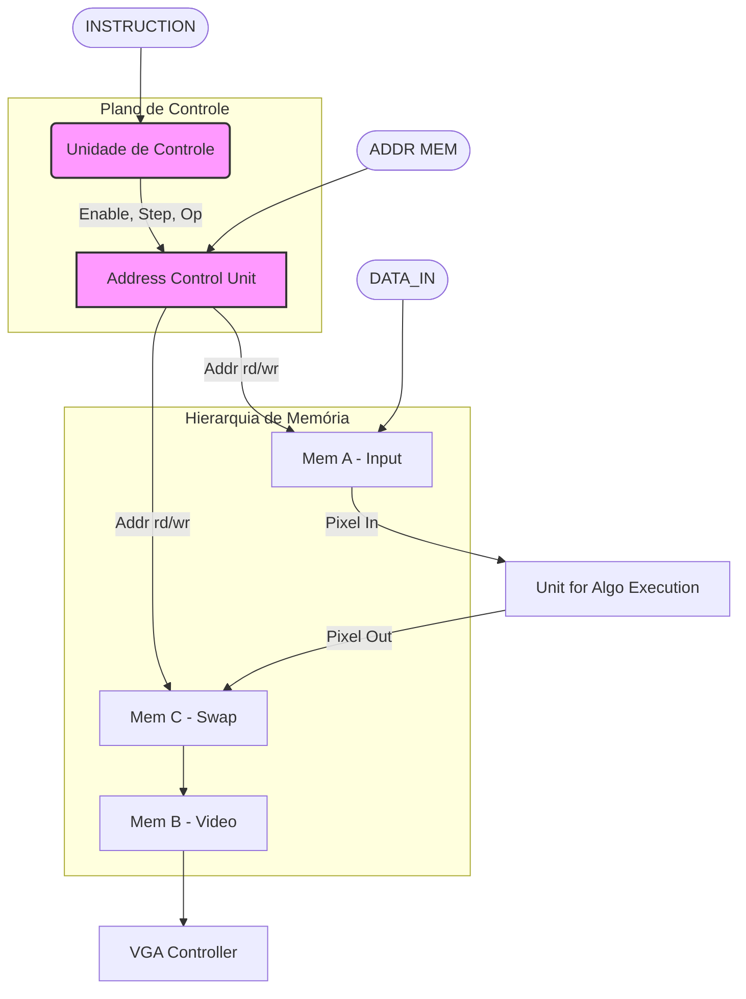

# 📷 Coprocessador Gráfico FPGA com Zoom Regional (DE1-SoC)

## 1. Definição do Problema

Este projeto visa desenvolver um sistema **SoC (System on Chip)** utilizando a placa DE1-SoC para aceleração de hardware de processamento de imagens. O objetivo principal é criar um coprocessador gráfico em FPGA capaz de realizar operações de Zoom em tempo real (*Upscaling* e *Downscaling*) em imagens, controladas por uma CPU ARM via barramento.

Um requisito fundamental é a **interatividade**: o usuário seleciona, via mouse, as coordenadas exatas de uma janela de interesse. Essas coordenadas são transmitidas para o hardware, que reconfigura seus parâmetros para processar apenas a região delimitada.

---

## 2. Fundamentação Teórica

Este projeto integra conceitos de Arquitetura de Computadores (Aceleração de Hardware) e Processamento Digital de Imagens (PDI). Abaixo, detalham-se os princípios matemáticos e lógicos que regem o funcionamento do coprocessador.

### 2.1 Imagem Digital como Matriz
Computacionalmente, a imagem carregada é tratada como uma função discreta $f(x, y)$, onde $x$ e $y$ são coordenadas espaciais e o valor de $f$ é a intensidade luminosa.
* **Profundidade:** O sistema opera em escala de cinza de 8 bits, permitindo $2^8 = 256$ níveis de intensidade ($0=$ preto, $255=$ branco).
* **Mapeamento:** A memória linear da FPGA é endereçada pela fórmula: $Addr = y \times Width + x$.

### 2.2 Algoritmos de Upscaling (Zoom In)
O aumento da resolução espacial envolve a estimativa de valores para pixels que não existem na imagem original.

#### A. Vizinho Mais Próximo (Nearest Neighbor)
É a técnica de interpolação de ordem zero. Para cada pixel na grade de destino $(x', y')$, projeta-se sua coordenada de volta à grade original $(x, y)$ e atribui-se o valor do inteiro mais próximo.
* **Modelo Matemático:** $f(x', y') = f(\text{round}(x), \text{round}(y))$.
* **Implicação no Hardware:** É o algoritmo mais rápido, pois não requer operações aritméticas complexas (somas ou multiplicações), apenas acessos à memória.
* **Artefatos:** Gera o efeito de "blocagem" ou serrilhado (*aliasing*), pois descontinua as bordas da imagem.

#### B. Replicação de Pixel (Pixel Replication)
Uma otimização de hardware do vizinho mais próximo para fatores de escala inteiros. Se o fator de zoom é $K$, cada pixel original é repetido $K$ vezes na horizontal e $K$ vezes na vertical.
* **Implementação na FPGA:** O controlador de vídeo lê o mesmo endereço de memória múltiplas vezes antes de incrementar o contador de colunas/linhas, reduzindo a necessidade de lógica de cálculo de endereços na Unidade de Execução.

### 2.3 Algoritmos de Downscaling (Zoom Out)
A redução da resolução espacial exige o descarte ou a fusão de informações para evitar poluição visual.

#### A. Decimação (Subsampling)
Reduz a imagem mantendo apenas o $n$-ésimo pixel e descartando os demais.
* **Processo:** Para um fator de 2, o sistema lê os pixels nas posições $(0,0), (0,2), (0,4)...$ e ignora as colunas ímpares.
* **Custo Computacional:** Extremamente baixo ($O(1)$ por pixel gerado), ideal para visualização rápida.
* **Desvantagem:** Viola o Teorema de Nyquist se a imagem contiver altas frequências, gerando *aliasing* (padrões de interferência ou "moiré").

#### B. Média de Blocos (Block Averaging)
Técnica que substitui um bloco de $N \times N$ pixels pela média aritmética de seus valores.
* **Modelo Matemático:**
  $$Pixel_{novo} = \frac{1}{N^2} \sum_{i=0}^{N-1} \sum_{j=0}^{N-1} f(x+i, y+j)$$
* **Vantagem Visual:** Atua como um **Filtro Passa-Baixa**, suavizando a imagem e reduzindo ruído de alta frequência antes da redução, o que mitiga o *aliasing*.
* **Custo no Hardware:** Exige somadores e um divisor (ou *bit-shifter* para potências de 2). No projeto, a divisão por 4 é realizada via deslocamento de bits (`>> 2`), otimizando o uso de células lógicas da FPGA.

### 2.4 Arquitetura de Aceleração (Offloading)
O sistema baseia-se no princípio de **Offloading Computacional**:
1.  **Gargalo de Von Neumann:** Processar 76.800 pixels (320x240) iterativamente na CPU seria lento devido ao overhead de busca de instruções.
2.  **Paralelismo Espacial:** A FPGA (Hardware) possui uma *Unit for Algorithm Execution* (UAE) dedicada. Enquanto a CPU ARM gerencia a interface do usuário (mouse/teclado), o hardware manipula o fluxo de bits da imagem em paralelo ao sinal de vídeo.
3.  **Memory Mapped I/O (MMIO):** A comunicação não ocorre por cópia de dados tradicional, mas pelo mapeamento direto dos endereços físicos da ponte HPS-FPGA para o espaço virtual do Linux, permitindo latência mínima.
---

## 3. Descrição da Solução (Arquitetura)

A solução utiliza uma arquitetura de camadas (*Hardware/Software Co-Design*).

   

  
<em>Fig 1: Pilha de Arquitetura do Sistema</em>

### 3.1 Hardware (FPGA)
O acelerador segue o modelo *Control-Datapath* com gerenciamento de endereçamento dedicado.

#### 3.1.1 Detalhamento do Subsistema de Vídeo (`vga_module.v`)
O módulo VGA é o componente de mais baixo nível, responsável por gerar os sinais de temporização analógica para o monitor (640x480 @ 60Hz). Ele opera com um clock de 25MHz e implementa duas **Máquinas de Estados Finitos (FSM)** paralelas:

* **FSM Horizontal:** Gerencia as varreduras de linha. Transita pelos estados `H_ACTIVE` (desenho), `H_FRONT`, `H_PULSE` (Sincronismo) e `H_BACK`. Gera o sinal `line_done` ao final de cada linha.
* **FSM Vertical:** Gerencia a varredura de quadros (frames). Incrementada apenas quando uma linha horizontal é concluída.

**Características Críticas:**
* **Interface de Coordenadas (`next_x`, `next_y`):** O módulo calcula qual pixel deve ser desenhado no *próximo* ciclo de clock. Esses sinais são enviados para a memória de vídeo (`Mem B`) para buscar o dado antecipadamente.
* **Sinais de Sincronismo (`hsync`, `vsync`):** Gerados com polaridade ativa baixa/alta configurável, essenciais para que o monitor mantenha a imagem estável.
* **Blanking:** Garante que os canais de cor (R, G, B) sejam zerados (preto) durante os períodos de *Front/Back Porch* e *Sync Pulse*, evitando artefatos visuais nas bordas da tela.

#### 3.1.2 Subsistema de Gerenciamento de Clock (PLL)
O sistema integra o módulo **`pll_0002`**, uma instância do IP Core *Altera PLL* configurado para a família Cyclone V. Este componente é responsável por derivar os domínios de tempo necessários a partir do oscilador de cristal de 50 MHz da placa DE1-SoC.

**Parâmetros de Síntese (Extraídos do RTL):**
O PLL opera em modo **Normal** com multiplicador de VCO não-fracionário (`fractional_vco_multiplier="false"`), garantindo estabilidade de fase (Phase Shift 0ps) para todos os canais.

| Porta | Frequência | Duty Cycle | Aplicação Arquitetural |
| :--- | :--- | :--- | :--- |
| **Input (`refclk`)** | **50.0 MHz** | - | **Clock de Referência:** Fonte externa (Cristal da DE1-SoC). |
| **Output 0 (`outclk_0`)** | **100.0 MHz** | 50% | **System Clock (Fast Domain):** Alimenta a Unidade de Controle e a lógica de processamento (UAE). A frequência de 100MHz permite que o hardware execute 4 ciclos de lógica para cada ciclo de pixel VGA, garantindo *throughput* suficiente para os algoritmos. |
| **Output 1 (`outclk_1`)** | **25.0 MHz** | 50% | **Pixel Clock (Video Domain):** Frequência exata exigida pelo padrão VESA para temporização VGA 640x480 @ 60Hz. Alimenta exclusivamente o módulo `vga_module`. |
| **Output 2 (`outclk_2`)** | **100.0 MHz** | 50% | **Clock Auxiliar 1:** Disponível para interfaces de memória externa ou lógica de alta velocidade adicional. |
| **Output 3 (`outclk_3`)** | **100.0 MHz** | 50% | **Clock Auxiliar 2:** Porta de expansão de clock. |

**Sincronização de Reset (`locked`):**
O módulo exporta o sinal `locked`, que indica o travamento da fase do PLL. Este sinal é utilizado na lógica de *System Reset*: o sistema gráfico permanece paralisado até que `locked` seja alto, prevenindo a operação de circuitos digitais com clocks instáveis durante a inicialização.

### 3.2 Software (Driver & App)
* **Aplicação (C):** Interface CLI, gestão de mouse (`/dev/input`) e cache de níveis de zoom.
* **Driver (Assembly):** Middleware que usa um **Pacote de Instrução Unificado (29 bits)** para eficiência no barramento.

   

   Figura: Conversão 

## 4. Metodologia de Testes
A validação focou na **Integração e Fluxo de Controle**, visto que a lógica RTL base já havia sido validada <a href="https://github.com/DestinyWolf/Problema-SD-2025-2">aqui</a>

### ✅ Teste de Fluxo via LEDs
Utilizamos a matriz de LEDs da DE1-SoC para diagnóstico visual temporário:
1. Estados da FSM foram mapeados para LEDs específicos através do fluxo das instruções. Os filetes de led acendiam aleatoriamente e mudavam sua organização de acordo com a nova instrução a ser processada pelo Verilog.
2. Verificou-se visualmente a transição `Idle` $\to$ `Processing` $\to$ `Done` ao enviar comandos do software.

---

## 5. Análise de Resultados
O sistema atingiu os objetivos, carregando BMPs e aplicando zoom em tempo real na saída VGA.

   

  
<em>Fig 2: Sistema em operação na janela padrão de 320x240 </em>

### 🛠️ Problemas e Correções (Troubleshooting)
Felizmente essa etapa do projeto não trouxe problemas, mesmo com as novas implementações.
